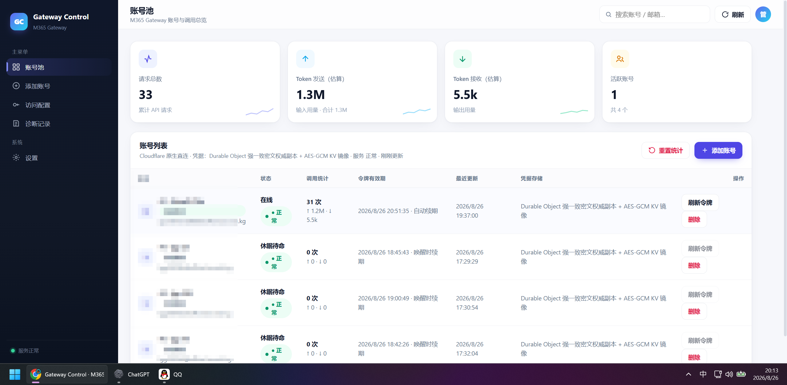

# M365 Gateway Cloudflare 原生开源版（CF 版）

版本：`0.1.0`  
许可证：MIT  
部署形态：Cloudflare Workers + Static Assets + Durable Objects + KV

这是完全运行在 Cloudflare 上的独立部署形态。Worker 直接连接 Microsoft 365 ChatHub，不依赖 VPS、Nginx、Docker、Cloudflare Tunnel 或任何本机/服务器源站，也不使用代理。

> 本目录是明确独立的 **Cloudflare（CF）版本**，不是 Go/VPS 服务器版本。默认使用 `workers.dev` 域名；自定义域名、KV 命名空间和加密 Secret 必须由部署者自行创建，包内不包含任何生产账号、生产域名或真实密钥。

## 项目宣传与交流



问题反馈、安装交流和版本讨论：QQ群 **35337083**。提交问题时请先删除域名、邮箱、OAuth 回调 URL、API Key、令牌和加密 Secret 等敏感信息。

## 目录说明

- `src/`：Cloudflare Worker、Durable Objects、Microsoft OAuth 与兼容 API 实现。
- `web/`：同域管理后台静态资源。
- `testdata/`：脱敏的 SignalR 协议回归夹具。
- `scripts/`：管理后台契约检查、候选环境功能回归和 soak 测试。

- `optional-egress-relay/`：可选的固定目标出口 Relay；直接使用 Cloudflare 出口时不需要部署。
- `wrangler.jsonc`：可公开提交的部署模板；其中全零 KV ID 必须替换。

## 架构与数据边界

- Cloudflare Worker：管理 API、OAuth、OpenAI/Anthropic 兼容 API、ChatHub WebSocket 客户端。
- Static Assets：同域管理后台。
- `TenantState` Durable Object（SQLite）：Microsoft OAuth 凭据的 AES-256-GCM 密文权威副本、账号非敏感元数据、管理员密码的 PBKDF2 哈希、管理会话、API Key 的 SHA-256 哈希、幂等调用统计和最多 200 条的结构化诊断环。管理页中简称为“Durable Object 强一致密文权威副本”。
- `SENSITIVE_KV`：保存与 Durable Object 相同的 AES-GCM OAuth 加密密文，作为异地镜像/备份而不是请求热路径。KV 键名是随机不透明值，不含邮箱、OID 或令牌。完整存储边界为“Durable Object 强一致密文权威副本 + AES-GCM KV 镜像”。
- `ChatSession` Durable Object（SQLite）：每个客户端会话独立保存上游 conversation/session 标识、并发租约和 Responses 待处理工具调用。

`DATA_ENCRYPTION_KEY` 必须作为 Cloudflare Secret 注入。真实密钥、OAuth token、管理员密码和完整 API Key 都不得写入源码、`wrangler.jsonc`、日志或 Git。OAuth 明文只在一次请求的内存中短暂存在；Durable Object 和 KV 持久化的都只有 AES-GCM 密文。

Cloudflare KV 是最终一致存储，因此新建和刷新账号时会先在 `TenantState` 中原子提交密文及版本，再同步 KV 镜像。KV 写入失败会进入持久化指数退避队列，由 `TenantState` 当前唯一的 alarm 处理器重试；账号读取始终使用强一致的 Durable Object 密文，不会因为另一个 PoP 暂时读不到 KV 而误隔离。旧版本的 `kv:` 凭据行会在首次成功读取后原子回填为 Durable Object 密文；旧 KV 暂时不可见只按瞬时故障处理，损坏密文或错误加密密钥才会安全隔离账号。

## 已实现能力

- 多账号全局单活：首次固定序号 `1`，正常请求持续使用同一活动账号，不按会话轮询。只有可归因的账号级故障才以持久化 CAS 代际推进到紧邻健康账号；并发迟到结果不能跳号或回拨。休眠账号不读取凭据、不刷新令牌，也不建立上游门控。
- Microsoft OAuth PKCE 授权、令牌刷新单飞控制、强一致加密凭据存储和 KV 加密镜像。
- OpenAI 兼容 `/v1/models`、`/v1/chat/completions`、`/v1/responses`，以及 Anthropic Messages 兼容 `/v1/messages`。
- Chat 与 Responses 的流式和非流式响应，5 秒保活、明确成功/失败终态与 `[DONE]`。
- 长任务使用同一逻辑请求截止时间：从收到请求起最长 10 分钟，排队、一次有界重连和上游读取共享该预算，不会因重试叠加成无限任务。流式期间使用 5 秒 SSE 保活，超时会返回明确失败终态。
- Responses `previous_response_id`、`prompt_cache_key`、客户端 thread/session/root-turn 标识和 conversation 会话续接；稳定键按 API 凭据隔离并哈希存储。
- Responses 别名保留有界：单个上游 conversation 最多保留最新 64 个 response alias，单租户最多 512 个，alias 的可解析时间窗为 7 天；稳定会话键不参与这个别名数量淘汰。
- 函数工具 `auto`、`required` 和指定函数；原生/文本工具调用统一执行参数 Schema 校验，工具结果按 `call_id` 校验并只允许消费一次。
- 程序化工具循环保护：相同调用指纹、重复失败、重复结果、pending 重复、调用 ID 重放和工具轮次上限都会在再次下发前熔断；跨 Responses alias 只持久化不可逆指纹，不保存原始工具参数或结果。
- 同一会话并发互斥；客户端断开时取消上游读取并释放会话租约。
- 同一 Microsoft 365 账号的上游调用全局串行化，不同会话不会并发轰击同一个账号；两次上游调用至少间隔 1 秒。
- 账号繁忙时请求最多排队 120 秒，超过上限返回 HTTP 429 和 `account_busy`，由客户端在退避后重试，不会无限等待。
- 必需工具调用最多进行两次有界格式修复，修复轮固定同一账号和会话边界，不做无限代理循环。
- 超长历史按模型上限有界裁剪：保留首条系统/开发者约束和最近完整对话，防止 Worker 内存无界增长。
- WebSocket 单帧 4,000,000 字符、单回答 8,000,000 字符、最多 128 个工具定义、AI 请求体 8 MiB 的硬上限。
- 上游错误固定映射；异常、日志和 API 响应均不回显 ChatHub URL、OAuth token 或请求密钥。
- 管理后台展示真实的全局/每账号调用与 Token 统计；重置操作会原子清空统计。诊断环只接受内部请求 ID、HTTP 方法、无查询参数路径、状态码和有界耗时，不保存请求正文、邮箱、令牌、API Key 或任意异常文本。
- `/api/admin/settings` 返回部署形态的显式能力矩阵；Cloudflare 原生版不支持的账号代理、文件系统路径、进程启动和运行时设置写入均标记为 `false`，前端不会显示伪操作入口。

当前公开模型为：

- `gpt-5.5`
- `gpt-5.5-reasoning`
- `gpt-5.6-sol`（`gpt-5.6` 别名）
- `gpt-5.6-reasoning`
- `claude-sonnet`
- `claude-sonnet-reasoning`

模型目录只声明已经验证的文本、流式、Responses、工具和推理能力。代码库内已接入图片输入附件与 `/v1/images/generations` 候选链路，但尚未完成真实 M365 上游验收，因此模型目录仍将 `vision`、`image_generation` 标记为 `false`，正式部署前也不得把它们宣传为稳定能力。音频、Realtime 和语音没有可用实现，不得伪装成可用。

## 本地验证

要求 Node.js 20 或更高版本。

```powershell
cd M365-Gateway-Cloudflare-0.1.0
npm ci
Copy-Item .dev.vars.example .dev.vars
# 将 .dev.vars 中的 DATA_ENCRYPTION_KEY 替换为独立的 32 字节 base64url 随机值
npm run check
npm run dev
```

`.dev.vars` 必须被 Git 忽略，测试值不得用于生产。

线上功能回归脚本必须通过环境变量传入 API Key；脚本读取后会立即从当前 Node.js 进程环境中删除该变量，并且测试报告不会保存完整密钥。若目标是生产域名，应同时把 `M365_PRODUCTION_HOST` 设置为该主机名；脚本默认拒绝该主机，只有显式设置 `M365_ALLOW_PRODUCTION=1` 才会继续。可以先只验证单个模型，再逐步扩大范围：

```powershell
$env:M365_TEST_API_KEY = "m365_仅在当前终端临时使用的测试密钥"
$env:M365_TEST_MODELS = "gpt-5.6-sol"
$env:M365_TEST_SCOPE = "regression"
node scripts/full-functional.mjs
Remove-Item Env:M365_TEST_API_KEY,Env:M365_TEST_MODELS,Env:M365_TEST_SCOPE -ErrorAction SilentlyContinue
```

`M365_TEST_MODELS` 只限制本轮发起请求的模型，不改变 `/v1/models` 的完整公开目录。不要对同一个 Microsoft 365 账号并发运行多份回归脚本；每账号门控会串行上游请求，但大量测试排队仍会造成长延迟并提高上游风控风险。

## 完整安装部署流程

下面是从空目录到可以发起第一条 API 请求的完整流程。建议严格按顺序执行；每一步都给出了成功判据和失败时应检查的地方。

### 第 0 步：准备环境

1. 安装 Node.js 20 或更高版本（建议当前 LTS），安装完成后重新打开终端。
2. 确认 Node.js、npm 和 Wrangler 能运行：

   ```powershell
   node --version
   npm --version
   npx wrangler --version
   ```

   `node --version` 必须是 `v20` 或更高；如果 `npx wrangler` 询问是否安装，输入 `y`，或先执行本项目的 `npm ci`。
3. 准备一个 Cloudflare 账号和一个 Microsoft Entra 管理入口。免费计划也可以开始测试，但 Workers、KV、Durable Objects 的当前配额和计费规则以 Cloudflare 控制台为准。
4. 准备一个可用的 Microsoft 365 ChatHub 账号/租户，并确认租户策略允许 OAuth 委托权限。网关本身不提供 Microsoft 账号，也不会替你绕过租户的条件访问或管理员同意。

### 第 1 步：取得并检查源码

从 source zip 解压，或克隆仓库后进入项目根目录。项目根目录必须同时包含 `package.json`、`wrangler.jsonc`、`src/` 和 `web/`：

```powershell
Set-Location "C:\path\to\M365-Gateway-Cloudflare-0.1.0"
if (!(Test-Path .\package.json) -or !(Test-Path .\wrangler.jsonc) -or !(Test-Path .\src) -or !(Test-Path .\web)) {
  throw "当前目录不是 M365-Gateway-Cloudflare 项目根目录"
}
npm ci
```

`npm ci` 成功后，项目会出现 `node_modules/`；该目录是本机生成物，不需要提交。若锁文件和 `package.json` 不一致，必须重新取得同一版本的完整源码，不要用 `npm install` 静默改写锁文件。

### 第 2 步：注册 Microsoft Entra 应用（OAuth）

1. 打开 Microsoft Entra 管理中心 → **App registrations** → **New registration**。
2. 选择符合租户策略的支持账户类型，创建后复制 **Application (client) ID**。这是公开客户端标识，不是客户端 Secret。
3. 进入 **Authentication** → **Add a platform** → **Mobile and desktop applications**，添加以下重定向 URI（必须逐字匹配）：

   ```text
   https://login.microsoftonline.com/common/oauth2/nativeclient
   ```

4. 进入 **API permissions**，添加委托权限 `openid`、`profile`、`offline_access`，以及 `wrangler.jsonc` 中 `M365_SCOPE` 列出的两个 Microsoft 365 ChatHub scope。
5. 如果租户要求管理员批准，点击 **Grant admin consent**。只登录成功但未同意权限时，后续换取令牌仍会失败。
6. 当前流程使用 Authorization Code + PKCE，不需要客户端 Secret；不要创建后把 Secret 写入仓库，也不要把用户密码交给网关。

将自己的 Application (client) ID 写入 `wrangler.jsonc` 的 `M365_CLIENT_ID`。除非你同时在 Entra 中登记了新的 URI，否则保留 `M365_AUTHORITY`、`M365_REDIRECT_URI` 和 `M365_SCOPE`。任何大小写、路径或结尾斜杠不一致都会出现 `redirect_uri_mismatch`。

### 第 3 步：登录 Cloudflare 并确认账号

在项目根目录执行：

```powershell
npx wrangler login
npx wrangler whoami
```

浏览器授权结束后，`whoami` 必须显示你准备部署的 Cloudflare 账号。若显示了错误账号，先执行 `npx wrangler logout`，再重新登录。CI 使用 API Token 时，只把 Token 放到 CI Secret/环境变量中，并先用 `npx wrangler whoami` 验证；不要放入 JSONC、README、日志或聊天记录。Token 的具体最小权限以 Wrangler 当前提示和 Cloudflare 控制台权限名称为准。

### 第 4 步：创建生产 KV 并填入绑定

KV 是 OAuth 密文的异地镜像；生产、预发布、本地预览必须使用不同命名空间：

```powershell
npx wrangler kv namespace create SENSITIVE_KV
```

复制输出中的生产 `id`，替换 `wrangler.jsonc` 内 `kv_namespaces[0].id` 的全零占位符
`00000000000000000000000000000000`。只改 `id`，保留 `binding: "SENSITIVE_KV"`。不要把 preview ID 当成生产 ID，也不要复用其他项目的 KV。

### 第 5 步：检查公开变量并设置加密 Secret

部署前逐项检查：

- `name` 是当前 Cloudflare 账号内唯一、便于识别的 Worker 名称。
- `M365_CLIENT_ID` 是刚才创建的 Entra 应用 ID。
- `M365_REDIRECT_URI` 与 Entra Authentication 中的 URI 完全一致。
- `kv_namespaces[0].id` 已不再是全零占位符。
- 没有把 API Key、OAuth token、管理员密码或 `DATA_ENCRYPTION_KEY` 写进文件。

生产 `DATA_ENCRYPTION_KEY` 必须是独立的 32 字节 base64url 随机值。下面的 PowerShell 只通过管道交给 Wrangler，不会写入项目文件：

```powershell
$bytes = New-Object byte[] 32
[Security.Cryptography.RandomNumberGenerator]::Fill($bytes)
$productionKey = [Convert]::ToBase64String($bytes).TrimEnd('=').Replace('+','-').Replace('/','_')
$productionKey | npx wrangler secret put DATA_ENCRYPTION_KEY
Remove-Variable productionKey,bytes
```

把密钥保存到离线密码管理器或企业 Secret Manager。密钥丢失后，Durable Object 和 KV 中的 OAuth 密文无法解密，只能重新授权账号；不要“生成一个新密钥试试”。

### 第 6 步：选择域名并部署

首次部署建议先使用 Wrangler 自动分配的 `workers.dev` 域名。需要自定义域名时，域名必须已经接入同一个 Cloudflare Zone，在 `wrangler.jsonc` 顶层加入自己的路由：

```jsonc
"routes": [
  {
    "pattern": "api.example.com",
    "custom_domain": true
  }
],
```

然后执行检查和部署：

```powershell
npm run check
npx wrangler deploy
```

首次部署会创建 `TenantState`、`ChatSession` Durable Object 绑定并应用 `v1` SQLite migration。终端输出的 Worker URL 和 version ID 请记录下来。不要删除旧 migration，也不要通过删除 Durable Object/KV 来“重置”部署。

### 第 7 步：验证 Worker、路由和存储

把主机替换为部署输出的 `workers.dev` 主机或自定义域名：

```powershell
$origin = "https://your-worker.your-subdomain.workers.dev"
$health = Invoke-RestMethod "$origin/api/health"
$health | ConvertTo-Json
npx wrangler deployments list
```

`GET /api/health` 应返回 HTTP 200，并只显示平台/存储类型，不显示账号、令牌或密钥。若为 404，先检查 URL 和 `routes`；若为 5xx，先查看 Wrangler 部署结果和 Cloudflare Worker 日志，确认不是部署到错误账号。

### 第 8 步：初始化管理后台

1. 浏览器打开 `$origin/`，进入登录页。
2. 全新 Durable Object 的引导密码是 `admin888`。登录后立即修改为至少 8 个字符的唯一密码；这是公开模板值，不能长期使用。
3. 重新部署不会覆盖已经修改过的密码；忘记密码时按项目提供的管理员恢复流程处理，不要直接删除生产数据。
4. 进入“平台与账号”，点击“添加账号”，完成 Microsoft 登录和授权。
5. 授权结束后，按页面提示粘贴浏览器最终回调 URL（包含 `code`、`state` 的完整地址）。该 URL 只能在当前授权流程中使用，不能发到群聊、工单或日志。
6. 等账号状态变为在线后，进入“API 密钥”创建客户端 Key。完整 `m365_...` 只显示一次，关闭页面后无法恢复；丢失时撤销旧 Key 并新建。

令牌刷新由 Durable Object Alarm 在到期前主动执行；Microsoft 暂时不可用时使用有界指数退避。不要同时点击多个“刷新令牌”，也不要用脚本无限循环重试。

### 第 9 步：完成 API 端到端验收

只在当前终端临时保存 API Key，验收后立即删除环境变量：

```powershell
$env:M365_API_KEY = "m365_从管理页复制的完整密钥"
$headers = @{ Authorization = "Bearer $env:M365_API_KEY" }
Invoke-RestMethod "$origin/v1/models" -Headers $headers

$headers["Content-Type"] = "application/json"
$body = @{ model = "gpt-5.6-sol"; messages = @(@{ role = "user"; content = "只回答 OK" }) } | ConvertTo-Json -Depth 10
Invoke-RestMethod -Method Post -Uri "$origin/v1/chat/completions" -Headers $headers -Body $body
Remove-Item Env:M365_API_KEY -ErrorAction SilentlyContinue
```

模型列表成功、聊天失败时，Worker 和 API Key 已经基本正常，继续检查 Microsoft 账号授权、ChatHub 上游状态、账号队列和模型能力。不要把失败的工具调用或整个流原样无限重放。

### 第 10 步：接入 OpenCode/其他客户端

客户端填写 OpenAI-compatible 协议、Base URL `https://你的域名/v1`、模型 `gpt-5.6-sol`，并通过客户端 Secret/环境变量注入 `m365_...` Key。不要把 Key 写进 `opencode.jsonc` 或前端代码；不同 OpenCode 版本的凭据入口以 `opencode --help` 和本机界面为准。先验证 `/v1/models`，再开启流式、工具调用和 Responses 的 `previous_response_id` 续接。

### 第 11 步：上线后的日常检查

```powershell
npm run typecheck
npm run deploy:dry
npx wrangler secret list
npx wrangler deployments list
```

升级前记录当前 version ID 和配置；升级后按“健康检查 → 模型列表 → 最小聊天”顺序验收。回滚优先使用 Cloudflare Workers 控制台的上一版；CLI 版本支持时先运行 `npx wrangler rollback --help`，确认语法后再指定 version ID。回滚代码不会回滚 Durable Object/KV 数据，因此 migration 必须保持向后兼容。

## 首次部署（快速命令清单）

1. 登录 Cloudflare：

   ```powershell
   npx wrangler login
   ```

2. 创建 KV 命名空间：

   ```powershell
   npx wrangler kv namespace create SENSITIVE_KV
   ```

   将返回的命名空间 ID 写入 `wrangler.jsonc` 的 `kv_namespaces[0].id`，替换模板中的 `00000000000000000000000000000000`。这不是凭据，但每个部署应使用自己的命名空间。

3. 生成 32 字节随机加密密钥并写入 Cloudflare Secret。不要把输出保存进项目：

   ```powershell
   $bytes = New-Object byte[] 32
   [Security.Cryptography.RandomNumberGenerator]::Fill($bytes)
   $value = [Convert]::ToBase64String($bytes).TrimEnd('=').Replace('+','-').Replace('/','_')
   $value | npx wrangler secret put DATA_ENCRYPTION_KEY
   Remove-Variable value,bytes
   ```

4. 默认配置会发布到 Cloudflare 分配的 `workers.dev` 域名。需要自定义域名时，在 `wrangler.jsonc` 顶层加入自己的路由，不能照抄他人的域名：

   ```jsonc
   "routes": [
     {
       "pattern": "api.example.com",
       "custom_domain": true
     }
   ],
   ```

   然后执行完整检查并部署：

   ```powershell
   npm run check
   npx wrangler deploy
   ```

5. 打开管理后台。全新 Durable Object 的初始密码是 `admin888`，首次登录必须修改，新密码至少 8 个字符。已经修改过密码的部署不会被重新初始化或覆盖。

6. 在“平台与账号”中完成 Microsoft OAuth 授权，再在“API 密钥”中创建客户端密钥。完整密钥只显示一次，关闭页面后无法恢复，只能撤销并重建。

## OpenAI 兼容调用

Base URL：

```text
https://你的域名/v1
```

请求头：

```text
Authorization: Bearer m365_你的密钥
Content-Type: application/json
```

Chat 示例：

```powershell
$headers = @{ Authorization = "Bearer $env:M365_API_KEY"; "Content-Type" = "application/json" }
$body = @{ model = "gpt-5.6-sol"; messages = @(@{ role = "user"; content = "只回答 OK" }) } | ConvertTo-Json -Depth 10
Invoke-RestMethod -Method Post -Uri "https://你的域名/v1/chat/completions" -Headers $headers -Body $body
```

Responses 工具续接必须把首轮返回的 `response.id` 作为下一轮 `previous_response_id`，并提交完全匹配的 `call_id`。错误或已消费的 `call_id` 会被明确拒绝，避免重复执行有副作用的工具。

## Anthropic Messages 兼容调用

`/v1/messages` 复用与 OpenAI 接口完全相同的账号排序、会话租约、ChatHub 调用、配额分类、工具参数校验和工具循环熔断，不维护第二套容易漂移的上游实现。支持非流式/流式、`system`、文本块、`tool_use`/`tool_result`、`tool_choice` 的 `auto`、`any`、`none` 和指定工具。

```powershell
$headers = @{ "x-api-key" = $env:M365_API_KEY; "anthropic-version" = "2023-06-01"; "Content-Type" = "application/json" }
$body = @{
  model = "claude-sonnet-reasoning"
  max_tokens = 4096
  messages = @(@{ role = "user"; content = "只回答 OK" })
} | ConvertTo-Json -Depth 20
Invoke-RestMethod -Method Post -Uri "https://你的域名/v1/messages" -Headers $headers -Body $body
```

流式响应严格使用 Anthropic 的 `message_start → content_block_start/delta/stop → message_delta → message_stop` 事件顺序；工具参数使用 `input_json_delta`。`tool_result.tool_use_id` 必须与上轮 `tool_use.id` 完全一致。相同工具参数连续产生相同失败后，第三次不变的调用会在接触账号前被程序化阻止；客户端应检查失败证据并修改动作，不能原样无限重试。

当同一个 Microsoft 365 账号已有上游请求执行时，其他会话会进入该账号自己的队列；不同账号之间互不阻塞。排队请求不会复用正在执行请求的 conversation/session，也不会因为本地繁忙随机切号。若 120 秒内未获得执行权，响应为：

```json
{
  "error": {
    "message": "account is busy; retry with backoff",
    "type": "account_busy",
    "code": "account_busy"
  }
}
```

客户端应采用带抖动的指数退避，且不得把同一个失败工具结果原样无限重放。HTTP 429 表示本地账号队列繁忙；上游鉴权、WebSocket、协议、工具格式和响应中断会使用各自独立的错误类型，不能统一按 429 处理。

## 运维与安全检查

```powershell
npm run typecheck
npm run deploy:dry
npx wrangler secret list
npx wrangler deployments list
```

生产环境的长期 Secret 只允许 `DATA_ENCRYPTION_KEY`，以及启用固定出口时彼此独立的 `RELAY5_HMAC_SECRET`/`RELAY7_HMAC_SECRET`。账号批量迁移端点默认关闭，不能用管理员 Cookie 或普通 `m365_` API Key 调用。只有候选版本带有配置指定的临时版本标签、通过 Version Override 命中该候选、设置 `MIGRATION_ENABLED=true`，并使用独立 `MIGRATION_SIGNING_KEY` 对实际版本 ID、时间戳、nonce、路径和原始请求体签名时才可用。使用版本标签避免在版本上传前无法预知 Cloudflare 版本 UUID 的循环配置问题；请求仍必须同时声明并签名运行时实际版本 UUID。nonce 和 migration ID 都在 Durable Object 中防重放；完成验证后必须删除临时迁移签名 Secret，将迁移开关恢复为 `false`，并在晋升生产前移除临时能力。

迁移批次最多 40 个账号，按请求数组顺序写入，`activeSequence` 指定唯一活动账号；其余账号保持路由隔离，只有分类故障触发按序接棒。每个账号保存 `direct`、`relay5` 或 `relay7` 的出口策略标识，OAuthTokenSet 仍先经 AES-256-GCM 加密，再原子写入 Durable Object SQLite 并进入加密 KV 镜像队列。Cloudflare 不能直接拨号服务器版 SOCKS 出口，因此 `relay5`/`relay7` 使用本包 `optional-egress-relay/` 的固定目标 WebSocket 协议：分别配置 `RELAY5_URL`/`RELAY7_URL`、独立 HMAC Secret 和精确的 `RELAY_ORIGIN`。访问令牌只进入 TLS 请求头并被摘要与签名绑定，不出现在 relay URL；配置缺失或非法时会明确失败，绝不会静默降级为 Cloudflare 直连。迁移请求和响应都不得写入日志或保存为仓库文件。

健康检查：

```text
GET /api/health
```

它只返回平台与存储类型，不返回账号、密钥或令牌。管理 API 使用 `HttpOnly; Secure; SameSite=Lax` 会话 Cookie；模型 API 只接受服务端保存哈希的 API Key，OpenAI 客户端可用 Bearer 头，Anthropic 客户端可用 `x-api-key` 头。

## 已知边界

- Cloudflare 原生版不提供通用 SOCKS/HTTP 代理；它只支持 `optional-egress-relay/` 定义的固定 Microsoft ChatHub WebSocket 出口，不能被调用方改成任意目标。账号采用全局单活：正常流量固定当前账号，可分类故障时才按序号接棒；单个逻辑请求至多接触当前账号和紧邻下一个账号。不会随机换号，历史会话跨账号续接必须先生成新的上游会话坐标，不能复用旧账号坐标。
- 每个账号分别接受全局串行保护，因此同账号并发请求会排队、不同账号可以并行；这是账号安全和上下文隔离策略，不是无限吞吐承诺。
- 图片输入与生成仍是未完成真实上游验收的候选能力；候选 API 存在，但模型目录不会宣称可用。音频、Realtime 和语音不支持。
- 稳定 Durable Object 会话 30 天未更新后自动过期。Responses alias 另行按 7 天、每上游会话 64 个、每租户 512 个的窗口保留；过期或已淘汰的 `previous_response_id` 会返回明确错误。
- Worker 与 Microsoft 365 服务的可用性仍受 Cloudflare 和 Microsoft 上游状态影响；网关会明确结束失败流，但不会在已经向客户端输出内容后透明重放请求。

## 免责声明

本项目仅供学习、研究和兼容性测试。使用者必须遵守 Microsoft、Cloudflare、模型提供方及所在地区的服务条款、授权范围和法律法规。不得用于绕过访问控制、滥用账号、批量规避风控或任何未经授权的用途。部署者对账号、数据、密钥、费用和合规承担全部责任。
